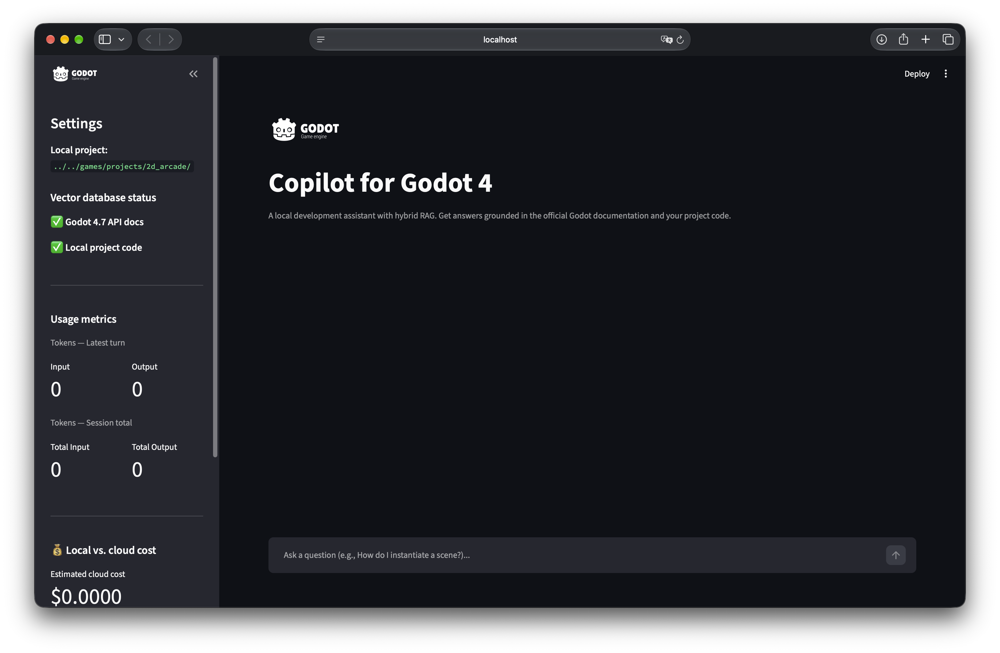
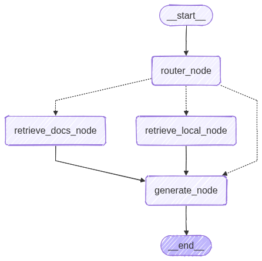

# Godot 4.7 Local RAG Copilot

[](LICENSE)
[](https://www.python.org/)
[](https://www.langchain.com/langgraph)
[](https://github.com/juanmamarquez/godot-local-rag-copilot/actions/workflows/tests.yml)

> [Read in English](README.md)

Copiloto RAG local para desarrollo de videojuegos con Godot 4.7. LangGraph enruta cada consulta entre la documentación oficial de Godot y los archivos GDScript de tu proyecto local. Puedes usarlo desde la UI de Streamlit o mediante un endpoint FastAPI compatible con OpenAI.





<video src="https://github.com/user-attachments/assets/c350ada4-37e8-44ee-9691-dff417bd7d50" width="100%" controls></video>


## Arquitectura y stack

- **Orquestación:** LangGraph y LangChain.
- **Inferencia local:** Ollama con `qwen2.5-coder:14b` para generación y `nomic-embed-text` para embeddings.
- **Almacenamiento vectorial:** índices de ChromaDB bajo `data/`.
- **Interfaces:** UI de Streamlit y endpoint FastAPI/Uvicorn compatible con el formato de chat-completions de OpenAI.
- **Mantenimiento:** CLI de Typer para reconstruir los índices de documentación y código local.

## Requisitos e instalación

Necesitas Python 3.12+ y [Ollama](https://ollama.com/). Ollama puede ejecutarse en esta máquina o en un host de inferencia accesible.

```bash
ollama pull qwen2.5-coder:14b
ollama pull nomic-embed-text
git clone https://github.com/juanmamarquez/godot-local-rag-copilot.git
cd godot-local-rag-copilot
python3 -m venv .venv
source .venv/bin/activate
pip install -r requirements.txt
cp .env.example .env
```

Configura `.env`:

```env
GODOT_PROJECT_PATH=/ruta/absoluta/a/tu/proyecto-godot
OLLAMA_HOST=http://localhost:11434
DISABLE_LOCAL_RAG_ROUTING=false
CORS_ALLOWED_ORIGINS=
```

## Crear los índices locales

El primer comando descarga la rama `4.7` del repositorio oficial `godot-docs` y crea su índice de ChromaDB. El segundo indexa todos los archivos `.gd` de `GODOT_PROJECT_PATH` y añade un resumen sintético para consultas generales sobre la arquitectura.

```bash
python scripts/cli.py reset-docs
python scripts/cli.py reset-local
```

`reset-local` indexa los archivos GDScript de `GODOT_PROJECT_PATH`.

## Uso

### UI de Streamlit

Inicia la interfaz web con `streamlit run src/ui.py` y abre <http://localhost:8501>. Muestra la ruta elegida para cada respuesta, métricas de tokens y una referencia de coste en la nube para la sesión local.

### API compatible con OpenAI

Inicia la API con streaming para usar el agente desde clientes como Continue.dev:

```bash
DISABLE_LOCAL_RAG_ROUTING=true uvicorn src.main:app --host 0.0.0.0 --port 8000 --reload
```

Activa `DISABLE_LOCAL_RAG_ROUTING=true` cuando el cliente ya envíe código del proyecto como contexto. El grafo omitirá la recuperación local: una ruta `local` irá directamente a generación y una ruta `both` consultará únicamente la documentación oficial. Por defecto vale `false`, así que la recuperación local sigue activa. Si defines esta variable en `.env`, afectará tanto a FastAPI como a Streamlit; al indicarla en el comando de la API, solo se aplica a ese proceso.

El endpoint es `http://localhost:8000/v1/chat/completions`.

### CORS

CORS está desactivado por defecto. Continue.dev llama a la API desde el proceso de la extensión, y la UI de Streamlit importa el flujo de LangGraph directamente en el mismo proceso: ninguno de los dos pasa por un navegador, así que ninguno lo necesita.

Actívalo solo si construyes un cliente en el navegador que llame a la API directamente, indicando en `.env` la variable `CORS_ALLOWED_ORIGINS` con una lista de orígenes permitidos separados por comas:

```env
CORS_ALLOWED_ORIGINS=http://localhost:3000
```

El endpoint no tiene autenticación, así que mantén esa lista tan reducida como lo necesite el cliente.

## Estructura del proyecto

```text
src/       Flujo de LangGraph, UI de Streamlit y servicio FastAPI
scripts/   CLI de Typer y pipelines de ingesta
data/      Índices vectoriales y documentos fuente locales (ignorados por Git)
assets/    Recursos visuales de los README
tests/     Tests unitarios puros de la lógica de enrutado
```

## Tests

Los tests unitarios cubren solo la lógica pura de enrutado; no simulan ni requieren Ollama o ChromaDB.

```bash
pytest tests
```

## Limitaciones conocidas

- La API solo admite streaming por Server-Sent Events. Las solicitudes con `stream: false` devuelven un error explícito.
- El enrutado depende de la salida textual de Qwen. Tolera puntuación o texto adicional comunes, pero una salida inesperada consulta ambas fuentes como alternativa segura.
- Es un prototipo local para un solo usuario: no incorpora autenticación, multitenancy ni configuración de despliegue productivo.

## Histórico de conversación

La UI de Streamlit persiste el histórico en un `chat_history.json` local a nivel de aplicación, no como memoria gestionada por el grafo. Para un prototipo monousuario es suficiente y permite sobrevivir a un refresh del navegador o a reiniciar Streamlit.

Los checkpointers de LangGraph, como `MemorySaver` y `SqliteSaver`, resuelven otra capa: múltiples hilos de conversación concurrentes, resúmenes automáticos de contexto largo y *time-travel* del estado. No forman parte de este prototipo de forma deliberada.

## Licencia y artículos relacionados

El código de este repositorio se distribuye bajo [MIT](LICENSE). Los artículos de Bitacora.dev son obras independientes y mantienen la licencia [CC BY-NC 4.0](https://creativecommons.org/licenses/by-nc/4.0/). Ninguna de las dos licencias modifica la otra obra.

Este proyecto acompaña la serie de [Bitacora.dev](https://bitacora.dev): [parte 1](https://bitacora.dev/engineering/desarrolla-copilot-privado-rag-parte-1), [parte 2](https://bitacora.dev/engineering/desarrolla-copilot-privado-rag-parte-2), [parte 3](https://bitacora.dev/engineering/desarrolla-copilot-privado-rag-parte-3) y [parte 4](https://bitacora.dev/engineering/desarrolla-copilot-privado-rag-parte-4).

## Contribuir

Consulta [CONTRIBUTING.md](CONTRIBUTING.md). Son bienvenidas contribuciones pequeñas y enfocadas que mantengan el carácter educativo y local-first del proyecto.
